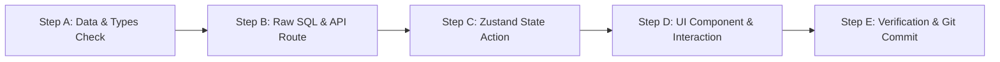

# 🔄 SyncFlow — Standard Operating Procedure (SOP) & Feature Workflow

Dokumen ini adalah **panduan alur pengerjaan standar (*Standard Operating Procedure*)** untuk membangun setiap fitur di SyncFlow. Setiap kali Anda ingin membuat fitur baru, ikuti **Pola 5 Langkah (A ➡️ B ➡️ C ➡️ D ➡️ E)** berikut secara konsisten.

---

## 🔁 Pola Universal 5 Langkah (The 5-Step Loop)



### 1. Step A: Cek Skema Database & TypeScript Types
* Buka `migrations/001_initial_schema.sql` untuk memastikan nama kolom dan tipe data yang terlibat.
* Buka `src/types/database.ts` untuk memastikan interface TypeScript yang sesuai sudah ada.

### 2. Step B: Buat Kueri Raw SQL & API Route Handler
* Buat file API di `src/app/api/.../route.ts`.
* Tulis kueri SQL menggunakan `sql` template literal (selalu parameterized query).
* Validasi input menggunakan Zod.
* Uji endpoint menggunakan browser / `curl` / Thunder Client / Postman untuk memastikan respon JSON berstatus `200 OK`.

### 3. Step C: Buat State & Action di Zustand Store
* Buka `src/stores/board-store.ts`.
* Buat *state* penampung data dan fungsi aksi (*action*).
* Terapkan **Optimistic Update**: ubah state lokal seketika di layar ➡️ panggil API di background ➡️ jika gagal, lakukan *rollback*.

### 4. Step D: Bangun Komponen UI & Hubungkan ke Store
* Buat komponen visual di `src/components/...` menggunakan Tailwind CSS.
* Hubungkan tombol/event handler ke action Zustand yang telah dibuat di Step C.
* Berikan *micro-interactions* (efek hover, loading state, visual active).

### 5. Step E: Uji Coba Manual & Git Commit
* Uji alur fitur secara langsung di browser:
  1. *Happy Path*: Aksi berhasil disimpan dan data tidak hilang saat halaman di-refresh.
  2. *Edge Cases*: Apa yang terjadi jika teks kosong? Jika koneksi gagal?
* Lakukan commit dengan pesan rapi:
  ```bash
  git add .
  git commit -m "feat(module): deskripsi singkat fitur"
  git push origin main
  ```

---

# 📋 Resep Pengerjaan Step-by-Step per Fitur (Feature Recipes)

Berikut adalah panduan **To-Do step-by-step spesifik** untuk masing-masing fitur utama:

---

## 🎯 Fitur 1: Single-Fetch Master Board Display (`/board/[id]`)

Tujuan: Menampilkan halaman papan Kanban lengkap dengan data kolom dan kartu awal dari database.

* [ ] **Step A (Types)**:
  * Pastikan interface `FullBoardData`, `FullColumn`, `FullTask` di `src/types/database.ts` sudah siap.
* [ ] **Step B (API Endpoint)**:
  * Buat file: `src/app/api/boards/[id]/route.ts`.
  * Tulis kueri `json_agg` (lihat referensi di `API_SPECIFICATION.md#1-master-board-endpoint`).
  * Return `Response.json(boardData)`.
* [ ] **Step C (Zustand Store)**:
  * Di `src/stores/board-store.ts`, tambahkan state:
    ```typescript
    boardData: FullBoardData | null,
    fetchBoard: async (boardId: string) => void
    ```
* [ ] **Step D (UI Components)**:
  * Buat `src/components/kanban/Board.tsx` (wadah pembungkus kolom).
  * Buat `src/components/kanban/Column.tsx` (merender header kolom + daftar kartu).
  * Buat `src/components/kanban/Card.tsx` (merender tiket `ENG-101`, judul, priority, labels, assignee).
  * Buat halaman `src/app/board/[id]/page.tsx` yang memanggil `fetchBoard(params.id)` saat dimuat.
* [ ] **Step E (Verifikasi)**:
  * Buka `http://localhost:3000/board/<board-id-dari-seed>` di browser.
  * Pastikan 5 kolom (*Backlog, To Do, In Progress, In Review, Done*) dan 2 task awal muncul dengan rapi.

---

## 🎯 Fitur 2: Drag-and-Drop Kartu Antar Kolom (`@dnd-kit`)

Tujuan: Memungkinkan kartu digeser antar kolom dengan animasi mulus dan posisi tersimpan permanen.

* [ ] **Step A (Check Field)**:
  * Kolom yang diubah di database adalah `tasks.column_id` dan `tasks.position` (`DOUBLE PRECISION`).
* [ ] **Step B (API Endpoint)**:
  * Buat file: `src/app/api/tasks/[id]/move/route.ts`.
  * Buat kueri:
    ```sql
    UPDATE tasks SET column_id = $1, position = $2, updated_at = NOW() WHERE id = $3 RETURNING *;
    ```
* [ ] **Step C (Zustand Optimistic Action)**:
  * Di `src/stores/board-store.ts`, tambahkan:
    ```typescript
    moveTaskOptimistic: (taskId: string, sourceColId: string, targetColId: string, newIndex: number) => void
    ```
  * Logika: Cari task di `sourceColId` ➡️ hapus dari `sourceColId` ➡️ sisipkan ke `targetColId` pada `newIndex` ➡️ hitung `newPosition` (Fractional Index).
* [ ] **Step D (Integrasi @dnd-kit)**:
  * Pasang `DndContext` dan `DragOverlay` di `Board.tsx`.
  * Pasang `SortableContext` dan `useDroppable` di `Column.tsx`.
  * Pasang `useSortable` di `Card.tsx`.
  * Hubungkan `onDragEnd` ke fungsi `moveTaskOptimistic` dan panggil `PATCH /api/tasks/[id]/move`.
* [ ] **Step E (Verifikasi)**:
  * Geser kartu dari *To Do* ke *In Progress*.
  * Kartu harus langsung berpindah tanpa kedip/loading.
  * Refresh browser ➡️ Posisi kartu harus tetap berada di kolom *In Progress*.

---

## 🎯 Fitur 3: Modal Pembuatan Task Baru (+ Create Task)

Tujuan: Tombol cepat untuk menambahkan tiket baru ke kolom tertentu.

* [ ] **Step A (Check Field)**:
  * Data yang dibutuhkan: `board_id`, `column_id`, `title`, `description`, `priority`, `estimate_points`.
* [ ] **Step B (API Endpoint)**:
  * Buat file: `src/app/api/tasks/route.ts` (Method `POST`).
  * Hitung `task_number` baru: `MAX(task_number) + 1`.
  * Hitung `position` baru: `MAX(position) + 1000`.
  * Insert ke tabel `tasks` dan catat ke `activity_logs` (`action = 'CREATED'`).
* [ ] **Step C (Zustand Action)**:
  * Tambahkan action: `createTask: (payload: CreateTaskInput) => Promise<void>`.
  * Masukkan task yang baru dibuat ke kolom yang sesuai di `boardData`.
* [ ] **Step D (UI Modal Component)**:
  * Buat `src/components/modals/CreateTaskModal.tsx`.
  * Formulir berisi: Input Judul, Dropdown Kolom, Dropdown Priority (Urgent, High, Med, Low), Input Story Points.
  * Pasang trigger tombol `+ Add Task` di bawah setiap kolom dan di header navbar.
* [ ] **Step E (Verifikasi)**:
  * Buka modal, buat task `"Refactor API authentication"`.
  * Kartu baru harus langsung muncul di kolom target dengan nomor urut tiket berikutnya (`ENG-103`).

---

## 🎯 Fitur 4: Task Detail Inspector (Slide-Over Drawer)

Tujuan: Mengklik kartu akan membuka panel samping untuk mengedit detail tugas secara *inline*.

* [ ] **Step A (Check Field)**:
  * Field yang bisa diedit: `title`, `description` (Markdown), `priority`, `due_date`, `estimate_points`.
* [ ] **Step B (API Endpoint)**:
  * Buat file: `src/app/api/tasks/[id]/route.ts` (Method `PATCH`).
  * Tulis kueri dinamis untuk meng-update field yang dikirim dan mencatat perubahan ke `activity_logs`.
* [ ] **Step C (Zustand Action)**:
  * Tambahkan state: `selectedTaskId: string | null`.
  * Tambahkan action: `updateTask: (taskId: string, updates: Partial<Task>) => void`.
* [ ] **Step D (UI Drawer Component)**:
  * Buat `src/components/modals/TaskDetailDrawer.tsx`.
  * Terapkan *Inline Auto-Save*: Saat user selesai mengetik deskripsi atau mengubah dropdown priority, kirim update ke backend tanpa tombol "Save" manual.
* [ ] **Step E (Verifikasi)**:
  * Klik salah satu kartu ➡️ Drawer terbuka dari kanan.
  * Ubah priority dari *Medium* menjadi *Urgent*.
  * Tutup drawer ➡️ Warna badge priority pada kartu di papan kanban otomatis berubah menjadi merah.

---

## 🎯 Fitur 5: Checklist / Subtasks System

Tujuan: Menambahkan sub-pekerjaan checklist di dalam kartu dengan indikator progress.

* [ ] **Step A (Check Field)**:
  * Tabel `task_checklists` (`task_id`, `title`, `is_completed`, `position`).
* [ ] **Step B (API Endpoint)**:
  * `POST /api/tasks/[id]/checklists` (Tambah checklist).
  * `PATCH /api/checklists/[id]` (Toggle `is_completed`).
  * `DELETE /api/checklists/[id]` (Hapus item).
* [ ] **Step C (Zustand Action)**:
  * Action `addChecklistItem(taskId, title)`.
  * Action `toggleChecklistItem(taskId, checklistId)`.
* [ ] **Step D (UI Component)**:
  * Pasang komponen Checklist di dalam `TaskDetailDrawer.tsx`.
  * Tampilkan progress bar persentase (misal: `2 of 4 completed (50%)`).
  * Tampilkan ringkasan ikon checklist di kartu kanban (`2/4`).
* [ ] **Step E (Verifikasi)**:
  * Tambah 3 checklist item, centang 1 item.
  * Pastikan progress bar berubah menjadi 33% dan tersimpan saat drawer dibuka ulang.

---

## 🎯 Fitur 6: Comments & Discussion Section

Tujuan: Memberikan wadah diskusi tim di dalam setiap tugas.

* [ ] **Step A (Check Field)**:
  * Tabel `task_comments` (`task_id`, `user_id`, `content`, `created_at`).
* [ ] **Step B (API Endpoint)**:
  * `GET /api/tasks/[id]/comments` (Ambil daftar komentar dengan join nama & avatar user).
  * `POST /api/tasks/[id]/comments` (Kirim komentar baru).
* [ ] **Step C (Zustand / Component State)**:
  * Fetch comments saat task drawer terbuka.
* [ ] **Step D (UI Component)**:
  * Buat `src/components/kanban/TaskComments.tsx`.
  * Tampilkan list komentar dengan avatar user dan waktu relatif (`"10 minutes ago"` via `date-fns`).
* [ ] **Step E (Verifikasi)**:
  * Tulis komentar `"Sudah saya deploy ke staging ya"`.
  * Komentar langsung muncul di daftar timeline.

---

## 🎯 Fitur 7: Global Filter Bar & Search

Tujuan: Memfilter kartu yang ditampilkan di papan kanban secara instan.

* [ ] **Step A (State Client-Side)**:
  * Di `src/stores/board-store.ts`, tambahkan state filter:
    ```typescript
    filters: {
      searchQuery: string,
      priority: number | null,
      assigneeId: string | null,
      labelId: string | null
    }
    ```
* [ ] **Step B (Filter Logic Selector)**:
  * Buat computed selector: `getFilteredColumns()` yang menyaring task berdasarkan kriteria filter aktif.
* [ ] **Step C (UI Component)**:
  * Buat `src/components/kanban/FilterBar.tsx` di atas papan kanban.
  * Komponen: Search Input teks, Dropdown Priority, Dropdown Assignee, Dropdown Label, dan tombol `Clear Filters`.
* [ ] **Step D (Verifikasi)**:
  * Ketik kata kunci di search bar ➡️ Kartu yang tidak cocok langsung disembunyikan seketika.
  * Pilih filter Priority: Urgent ➡️ Hanya kartu Urgent yang tampil di semua kolom.

---

## 🎯 Fitur 8: Command Menu (`Cmd + K`)

Tujuan: Navigasi dan eksekusi aksi super cepat via keyboard shortcut.

* [ ] **Step A (Event Listener)**:
  * Buat hook `src/hooks/useCommandMenu.ts` untuk menangani event `keydown` kombinasi `Cmd + K` / `Ctrl + K`.
* [ ] **Step B (UI Palette Component)**:
  * Buat `src/components/modals/CommandPalette.tsx`.
  * Fitur:
    - Cari task berdasarkan ID (`ENG-101`) atau judul.
    - Quick actions: Buat task baru, ganti board, toggle filter.
* [ ] **Step C (Verifikasi)**:
  * Tekan `Cmd + K` di keyboard ➡️ Command dialog terbuka.
  * Ketik `ENG-101` ➡️ Tekan Enter ➡️ Task detail drawer langsung terbuka.

---

Dengan mengikuti panduan To-Do dan alur **A ➡️ B ➡️ C ➡️ D ➡️ E** di atas, Anda bisa membangun seluruh platform SyncFlow secara terstruktur, rapi, dan mandiri! 🚀
